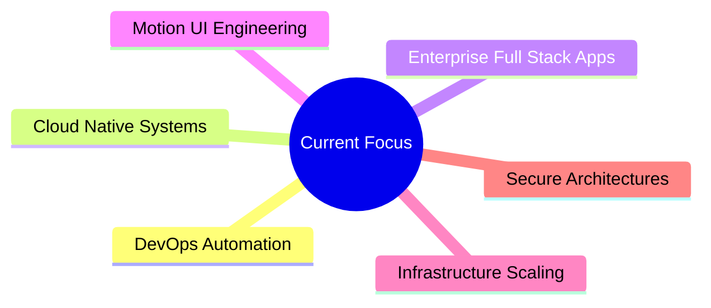

<div align="center">


<br/>

[](https://git.io/typing-svg)

<br/>


&nbsp;


</div>

---


## `~/about`

```yaml
name:     Nani Reddy
role:     Full Stack & DevOps Engineer
location: India
company:  Wipro | Webcros

stack:
  frontend: [ React, Next.js, TypeScript, GSAP, Framer Motion ]
  backend:  [ Spring Boot, Node.js, REST APIs, Microservices ]
  devops:   [ Docker, Kubernetes, Jenkins, AWS, CI/CD ]
  db:       [ MySQL, MongoDB ]

focus:
  - Scalable Cloud Native Systems
  - Motion-Driven UI Engineering
  - Enterprise Full Stack Apps
  - Secure DevOps Architectures

currently_learning: [ Cloud Native Patterns, Infrastructure Scaling ]
open_to: Freelance & Collaboration
```

<br clear="right"/>

---

## `~/stack`

<div align="center">
<br/>

**Languages & Frameworks**


<br/><br/>

**Styling & Motion**


<br/><br/>

**DevOps & Cloud**


<br/><br/>

**Databases & Tools**


</div>

---

## `~/domains`

<div align="center">
<br/>

| 🖥️ Full Stack | ⚙️ DevOps | 🎨 Motion UI |
|:---|:---|:---|
| Enterprise Application Architecture | CI/CD Pipeline Automation | GSAP & Framer Motion |
| REST API & Microservices Design | Docker & Kubernetes Orchestration | Scroll-Triggered Animations |
| React / Next.js Frontend Systems | AWS Cloud Infrastructure | Interactive UI Experiences |
| Spring Boot Backend Services | Infrastructure Scaling & Monitoring | Responsive Production Interfaces |
| Performance Optimization | Secure Deployment Pipelines | Code-First UI Engineering |

</div>

---

## `~/philosophy`

<div align="center">

> *"I engineer interfaces directly through code —*
> *combining motion, responsiveness, scalability,*
> *and modern user experience into production-ready systems."*

</div>

---

## `~/current-focus`



---

## `~/analytics`

<div align="center">
<br/>


<br/><br/>


<br/><br/>


</div>

---

## `~/highlights`

<div align="center">
<br/>

```
┌─────────────────────────────────────────────────────────┐
│                                                         │
│   🏢  DevOps Trainee          →   Wipro                 │
│   💼  Full Stack Developer    →   Webcros               │
│   🎓  COE Program Graduate    →   Tech Mahindra         │
│   🌍  Freelance Developer     →   Web Solutions         │
│                                                         │
└─────────────────────────────────────────────────────────┘
```

</div>

---

## `~/trophies`

<div align="center">
<br/>


</div>

---

## `~/connect`

<div align="center">
<br/>

<a href="https://github.com/nanineelapu">
  
</a>
&nbsp;
<a href="https://linkedin.com/in/YOUR_LINKEDIN">
  
</a>
&nbsp;
<a href="mailto:YOUR_EMAIL@gmail.com">
  
</a>

<br/><br/>

*Open to freelance projects, collaboration, and engineering challenges.*

</div>

---

<div align="center">


</div>
