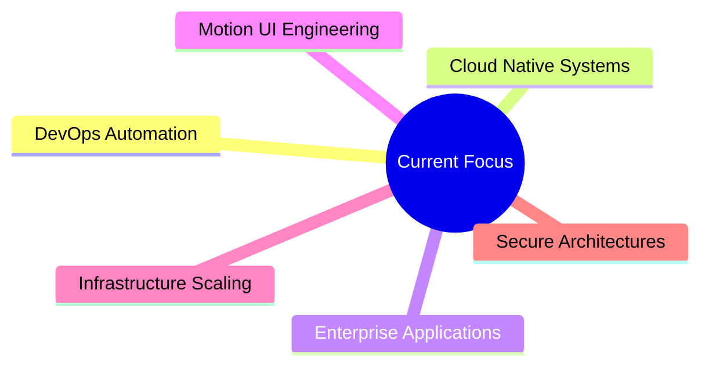

<div align="center">


<br/>

[](https://git.io/typing-svg)

<br/>


&nbsp;


</div>

---

# ⚡ About Me

```yaml
name: Nani Reddy
role: Full Stack & DevOps Engineer

current_work:
  - DevOps Trainee @ Wipro
  - Full Stack Developer @ Webcros
  - Freelance Web Solutions Developer

education:
  - Tech Mahindra COE Program Graduate

specialization:
  - Scalable Full Stack Applications
  - Motion-Driven Frontend Engineering
  - DevOps & Cloud Infrastructure
  - API & Microservices Architecture

frontend:
  - React
  - Next.js
  - TypeScript
  - Tailwind CSS
  - GSAP
  - Framer Motion

backend:
  - Java
  - Spring Boot
  - Node.js
  - REST APIs
  - Microservices

devops:
  - Docker
  - Kubernetes
  - Jenkins
  - AWS
  - CI/CD Pipelines

databases:
  - MySQL
  - MongoDB
```

---

# 🚀 Engineering Domains

<div align="center">

| 🖥️ Full Stack Engineering | ⚙️ DevOps Engineering | 🎨 Motion UI Engineering |
|---|---|---|
| Enterprise Application Development | CI/CD Pipeline Automation | GSAP Animations |
| REST APIs & Microservices | Docker & Kubernetes | Framer Motion |
| React / Next.js Architecture | AWS Cloud Infrastructure | Interactive UI Systems |
| Spring Boot Backend Systems | Infrastructure Scaling | Responsive Interfaces |
| Performance Optimization | Secure Deployments | Code-First UI Development |

</div>

---

# 🧰 Tech Stack

<div align="center">

### Languages & Frameworks


<br/><br/>

### Styling & Frontend


<br/><br/>

### DevOps & Cloud


<br/><br/>

### Databases & Tools


</div>

---

# 🎯 Frontend Philosophy

<div align="center">

```txt
I engineer interfaces directly through code —
combining motion, scalability, responsiveness,
and modern UX into production-ready systems.
```

</div>

---

# 📊 GitHub Analytics

<div align="center">


<br/><br/>


<br/><br/>


</div>

---

# ⚡ Current Focus



---

# 🏆 Highlights

<div align="center">

```txt
┌──────────────────────────────────────────────────────┐
│                                                      │
│  🏢 DevOps Trainee          → Wipro                  │
│  💼 Full Stack Developer    → Webcros                │
│  🎓 COE Graduate            → Tech Mahindra          │
│  🌍 Freelance Developer     → Web Solutions          │
│                                                      │
└──────────────────────────────────────────────────────┘
```

</div>

---

# 🏅 GitHub Trophies

<div align="center">


</div>

---

# 🌐 Connect

<div align="center">

<a href="https://github.com/nanineelapu">
  
</a>

&nbsp;

<a href="https://linkedin.com/in/YOUR_LINKEDIN">
  
</a>

&nbsp;

<a href="mailto:YOUR_EMAIL@gmail.com">
  
</a>

</div>

---

<div align="center">

Building scalable systems, modern interfaces, and cloud-native applications.

</div>

<br/>

<div align="center">


</div>
